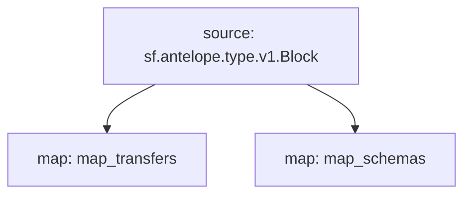

# Substream for Antelope NFTs
Antelope NFTs transfers

## Quick Start
```bash
make
make gui
make schema
```
### Mermaid graph


## Modules
```yaml
Package name: eosio_nfts
Version: v0.1.0
Doc: Antelope `atomicassets` based action traces.
Modules:
----
Name: map_transfers
Kind: map
Output Type: proto:antelope.eosio.nfts.v1.TransferEvents

Name: map_schemas
Kind: map
Output Type: proto:antelope.eosio.nfts.v1.SchemaEvents
```
