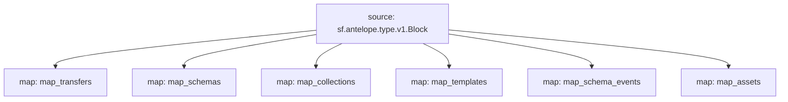

# `AtomicAssets` powered by **Substreams**

## Quick Start

```bash
make
make gui # transfers
```

### Mermaid graph



## Modules
```yaml
Package name: atomicassets
Version: v0.1.0
Modules:
----
Name: map_transfers
Initial block: 0
Kind: map
Output Type: proto:antelope.atomicassets.v1.TransferEvents
Hash: 50c273b630726b142cf376dbd32c28deda2e93ea

Name: map_schema_events
Initial block: 0
Kind: map
Output Type: proto:antelope.atomicassets.v1.SchemaEvents
Hash: 1dafc95edb03219e2269fd8be3802df30f3c5a06

Name: map_collections
Initial block: 0
Kind: map
Output Type: proto:antelope.atomicassets.v1.Collections
Hash: 1a028c93eec55fda418d6796601c861cf93fa051

Name: map_templates
Initial block: 0
Kind: map
Output Type: proto:antelope.atomicassets.v1.Templates
Hash: a1211f0d17570e5895a33df67251729d2752a267

Name: map_schemas
Initial block: 0
Kind: map
Output Type: proto:antelope.atomicassets.v1.Schemas
Hash: c2673d8ffca353b95d7e24189276c9d774955da9

Name: map_assets
Initial block: 0
Kind: map
Output Type: proto:antelope.atomicassets.v1.Assets
Hash: 01b019e688e8f569c5f1e66e2deab94e3fe5106a

Name: map_balances
Initial block: 0
Kind: map
Output Type: proto:antelope.atomicassets.v1.Balances
Hash: 3a1fe8ec0b379754bf801f983b3d835de3033eb1
```
