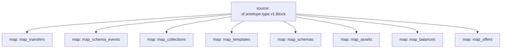

# `AtomicAssets` powered by **Substreams**

## Quick Start

```bash
make
make gui # transfers from/to atomicmarket
```
## map_transfers module
Please note that this module has a filter to only retrieve transfers regarding `atomicmarket` account.

### Mermaid graph



## Modules
```yaml
Package name: atomicassets
Version: v0.1.2
Modules:
----
Name: map_transfers
Initial block: 0
Kind: map
Output Type: proto:antelope.atomicassets.v1.TransferEvents
Hash: e74d6f5ac8f9cc0bd3f5da4a375ce2f95a652dad

Name: map_schema_events
Initial block: 0
Kind: map
Output Type: proto:antelope.atomicassets.v1.SchemaEvents
Hash: 735fab66e5f10daa8b4a316fc3d958f79be7b5ff

Name: map_collections
Initial block: 0
Kind: map
Output Type: proto:antelope.atomicassets.v1.Collections
Hash: ce19842a38cdc72a5ffa8023c819684aec6278ed

Name: map_templates
Initial block: 0
Kind: map
Output Type: proto:antelope.atomicassets.v1.Templates
Hash: baee783ad52cab4292a5b9f2cb277a0715fb52ff

Name: map_schemas
Initial block: 0
Kind: map
Output Type: proto:antelope.atomicassets.v1.Schemas
Hash: 5fecbceade853ef937de2b9e8e230a02bbc9ca2b

Name: map_assets
Initial block: 0
Kind: map
Output Type: proto:antelope.atomicassets.v1.Assets
Hash: 4d5bd2d9140fdedb46cd20083c1ff50832067f09

Name: map_balances
Initial block: 0
Kind: map
Output Type: proto:antelope.atomicassets.v1.Balances
Hash: 22af7b25eed48c5ff18cd01b6d2b6e2e37a8e51a

Name: map_offers
Initial block: 0
Kind: map
Output Type: proto:antelope.atomicassets.v1.Offers
Hash: 01fc9d3bef581530595718685c6d5f345045e7fa
```
