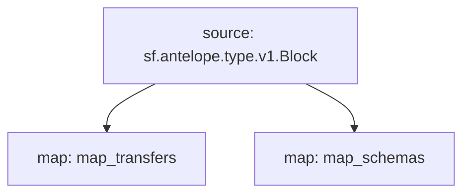

# `AtomicAssets` powered by **Substreams**

## Quick Start

```bash
make
make gui
```

### Mermaid graph



## Modules
```yaml
Package name: atomicassets
Version: v0.1.0
Modules:
----
Name: map_transfers
Initial block: 0
Kind: map
Output Type: proto:antelope.atomicassets.v1.TransferEvents
Hash: 7630b243ac10f8af29dff50f242a61dbb2771b33

Name: map_schemas
Initial block: 0
Kind: map
Output Type: proto:antelope.atomicassets.v1.SchemaEvents
Hash: fcb25af8bda9e90b25502ec5dd5cb5487708f85c
```
